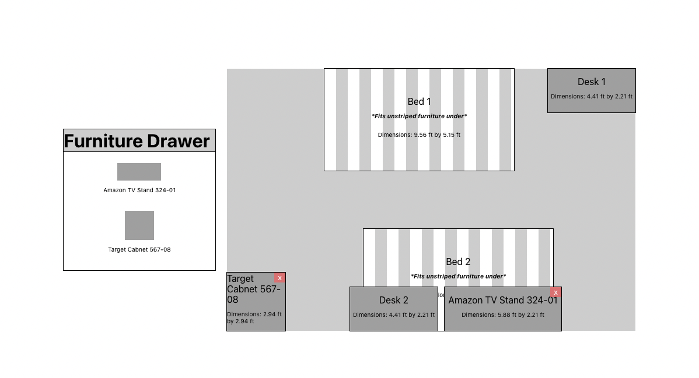

# Plan My Dorm - 2D Dorm Planner Demo
This demo was made for UX testing a 2D Dorm Planner feature in a dorm planning website. In this demo users can arrange furniture in a room from a birds eye view and can add or remove a tv stand or cabinet to a room that comes furnished with 2 beds and 2 desks.

This is a simple single page react application that uses the React-Draggable library and is deployed on Github pages. This demo was imported as an iframe into the larger website (which is no longer deployed) so that it could be comprehensively UX tested

**Demo deployed here:** https://kushagrachopra18.github.io/COMP590_PlanMyDorm/

## How to use

**How to arange furniture:**
- Furniture can be dragged and dropped around the room
- Solid colored pieces of furniture can be placed on top of striped furniture (to indicate being under) but striped furniture cannot be placed on top of solid furniture

**How to add/remove furniture**
- To add furniture to room, click the tv stand or cabnet in the "furniture drawer" then click "add to room +" in the popup. *Only one instance of both the tv stand and cabnet can be present in the room at a time*
- Remove furniture by clicking the red 'x' in the top right corner of the piece of furniture *Only the tv stand and cabnet can be removed*

